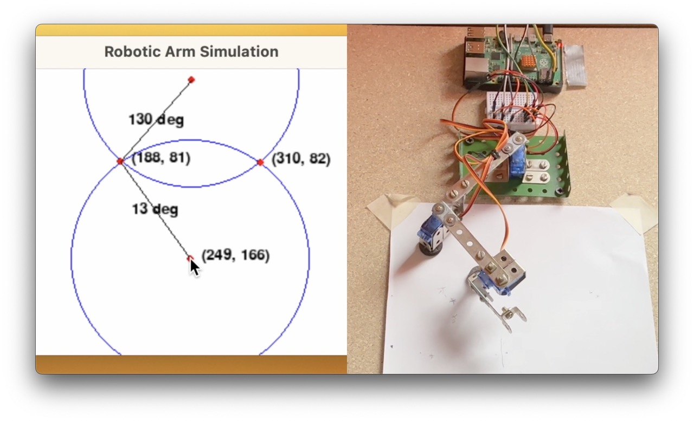

# Robot arm

This project (currently under development) aims to create software to control an articulated robotic arm.

The project consists of two Python scripts:

## RoboLink

The first script is the interface between the user and the robotic arm: it allows the user to select the target point at which the robotic arm is to move, simply by pointing the mouse at a window representing the diagram of the robotic arm.

The script then calculates the angles to move the two segments of the robotic arm, and finally sends the angles to the robot controller.

The position of the 'shoulder' is fixed, the position of the 'hand' is selected by the user, and the lengths of the two segments 'shoulder' to 'elbow' and 'elbow' to 'hand' are known.

The script relies on mathematical calculations to define the angles the two segments must form in order to point the hand where indicated by the user. 

First, the position of the 'elbow' is calculated as the intersection of the two circles centred on the 'shoulder' and the 'hand'.

After that, given the coordinates of the three points ('shoulder', 'elbow' and 'hand'), the script calculates the angles between the segments, i.e. the angles to be moved by the robotic arm's motors.

Of the two possible positions of the 'elbow', the script excludes the solution closest to the neutral position: due to limitations in the implementation of the robotic arm, movements at narrow angles are less accurate.

Finally, the script sends the calculated angle pair to the controller of the robotic arm through a MQTT connection.

## ArmController

The second script is the software that controls the movement of the robot: it receives commands from RoboLink user interface and moves the segments of the robotic arm accordingly.

The script is intended to run on a Raspberry Pi to which the robotic arm is connected via GPIO ports.

The script uses an MQTT connection to listen to a topic on which the RoboLink user interface publishes the angles for the movement of the motors mounted on the robot arm.

When it receives the data, the script creates two threads to move the motors simultaneously at the desired angles.

The movement of a servomotor requires low-level control: the script creates a PWM (Pulse Width Modulation) object with a frequency of 50 Hz, initially starts the PWM signal with a duty cycle of 0% (neutral position) and then loops from the start angle to the end angle by calculating the duty cycle to set the position of the servomotor.

In this way, the ArmController script is able to move the robot arm segments according to user input to position the 'hand' where required.
